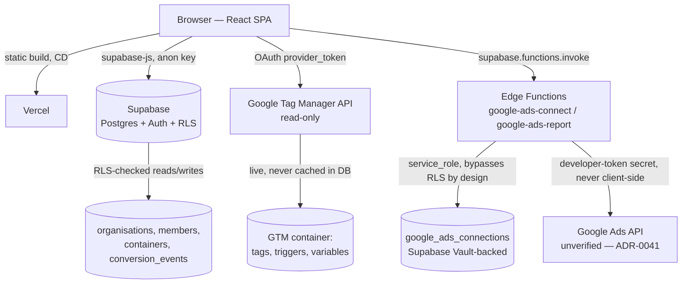

# 03 - Architecture

## System overview

TagOps-Pro is a single-page React application with no application server of its own. Two things stand in for one:

- **Supabase** (Postgres + Auth + PostgREST + Row-Level Security) holds everything TagOps-Pro owns: organisations, team membership, containers, and conversion events. The React app talks to it through `@supabase/supabase-js`, and every write is checked against an RLS policy at the database layer — there is no application-level authorisation code to bypass.
- **Google's own APIs** (Tag Manager API, scoped `tagmanager.readonly`) are called directly from the browser, authenticated with the OAuth `provider_token` issued when the user signs in with Google. Tag, trigger, and variable data is never copied into Supabase — the app always reads it live from GTM, so "what TagOps-Pro shows" and "what's actually in the container" can't drift apart.

That split is the app's defining architectural feature: it has two backends, not one, and they're used for entirely different kinds of data (TagOps-Pro's own organisational data vs. a live, read-only mirror of a third party's data).

**New for ADR-0041:** two Supabase **Edge Functions** (`google-ads-connect`, `google-ads-report`) are the first server-side code this app has ever run beyond SQL. They exist only because the Google Ads integration needs something the GTM integration doesn't: a secret (the Ads developer token) that must never reach the browser, and a long-lived OAuth refresh token that must be stored, not just held in session memory. Both functions run under Deno, are excluded from the app's own `tsconfig`/ESLint (they're a different runtime, linted/type-checked by the Supabase/Deno toolchain instead), and are deployed independently of the Vercel frontend build.

The desktop build (`/desktop`, Electron) is a thin wrapper around the same web build — it serves the identical `dist/` output over a custom `tagops://` protocol and only adds a native OAuth loopback workaround for Google blocking sign-in inside embedded webviews (see `decision-log.md`). It isn't part of the AT3 submission (ADR-0021) and doesn't duplicate any business logic.

## Architecture diagram

Nothing in this diagram is a real backend service TagOps-Pro operates in the traditional sense — Vercel serves static files, Supabase's PostgREST layer is auto-generated from the schema, and Google's APIs are third parties. The one exception is the two Edge Functions (ADR-0041): genuine server-side TypeScript this project authors and deploys, alongside the SQL (migrations, RLS policies, `SECURITY DEFINER` functions) that was previously the only thing running outside the browser.

## Request lifecycle — two worked examples

**1. Loading the Tags page** (`TagsView.tsx`): user clicks "Tags" in the sidebar → `AppShell` swaps `activeView` → `TagsView` reads the currently-selected GTM container from `GtmContext` (set once, app-wide, so switching sidebar sections doesn't refetch or lose the selection) → calls `src/lib/gtm.ts`, which issues a `GET` to the Tag Manager API with the session's `provider_token` in the `Authorization` header → Google returns the container's tags → rendered via `EntityRow`/`TagCard`. No Supabase table is involved at any point — a 403 here (API not enabled, or the OAuth scope wasn't granted) surfaces as `GtmForbiddenState`, not a generic error.

**2. Adding a team member** (`AddMemberModal.tsx` → `src/features/settings/api/settings.ts`): form submit → `addOrganisationMember()` calls `supabase.from('organisation_members').insert(...)` → `supabase-js` sends the request to Supabase's PostgREST endpoint → Postgres evaluates the `organisation_members` INSERT policy (must be an active owner/admin of the *target* organisation — fixed to actually check that, not just "any" organisation, in `20260827000000_fix_remaining_rls_gaps.sql`) → row commits only if the policy's `WITH CHECK` passes → the new row (or a rejection) comes back to the client. The RLS check is the real enforcement point in this flow, not a step the UI could skip by mistake.

**3. Loading live Google Ads conversion data** (`GoogleAdsConnectionPanel.tsx` → `supabase/functions/google-ads-report`, ADR-0041): user clicks "Load live conversion data" → `fetchGoogleAdsReport()` calls `supabase.functions.invoke('google-ads-report', ...)`, which forwards the user's own Supabase JWT → inside the function, a client scoped to that JWT confirms active membership in the organisation (RLS decides what it can see, same as any browser request) → a *separate* service-role client (the function's own secret, never sent to the browser) fetches the stored refresh token out of Supabase Vault via a `SECURITY DEFINER` RPC → the function exchanges it for a fresh Google access token, then calls the Ads API with the `developer-token` secret header → parsed stats return to the client. Two things make this different from the other two examples: it's the only flow in the app where server-side code (not just RLS) makes an authorisation decision, and — until a real developer token exists — the function short-circuits before ever reaching Google, returning `developer_token_not_configured` instead.

## Key architectural decisions

| Decision | Why | Reference |
|---|---|---|
| No separate backend — Supabase + RLS *is* the backend | Matches the mandated stack; pushes authorisation into the database where a compromised client can't bypass it. My own architectural call, made in Week 2 before any feature code existed — `decision-log.md` ADR-0003 — not something proposed mid-project | Security floor #2, `05-security-review.md`, `decision-log.md` ADR-0003 |
| GTM/GA4 data is read-only and never persisted | Tracking-platform safety rule — a stale copy of someone's real ad account is worse than no copy | `CLAUDE.md`, `src/lib/gtm.ts` |
| `SECURITY DEFINER` functions for anything RLS can't express directly (invite codes, cross-membership lookups) | RLS alone can't break certain circular checks (e.g. "can I see the members of an org I'm a member of" needs to read the same table its own policy protects) or hide a column like `invite_code` from ordinary `SELECT *` | ADR-0023, `is_active_org_member()` |
| Light/Dark/System theme via CSS custom-property token-swap, not a second stylesheet | One set of Tailwind utility names resolves correctly in both themes automatically | ADR-0027 |
| Electron desktop build reuses the web `dist/` output rather than a separate codebase | Zero duplicated business logic; only adds what's Electron-specific (native OAuth loopback, protocol handler) | ADR-0021 |
| Google Ads' `adwords` OAuth scope requested via its own explicit, Settings-only `signInWithOAuth` call, never bundled into `Login.tsx`'s | A restricted scope on the login path would gate sign-in itself behind Google's test-user allow-list (Testing publishing status) for every user, not just fail to grant Ads access | ADR-0037, ADR-0041 |
| Google Ads refresh token stored via Supabase Vault behind a `SECURITY DEFINER`/`service_role`-only function pair, not a plain column | Matches Security Floor #6 (no plaintext storage of sensitive data) for a token that, unlike the session-only GTM token, is genuinely persisted | `05-security-review.md`, ADR-0041 |

## Deployment / CI-CD

Vercel is connected directly to this repository's `main` branch — every push triggers a build (`npm run build`, i.e. `tsc -b && vite build`) and a new deployment; there's no separate CI step beyond that build. Two environment variables (`VITE_SUPABASE_URL`, `VITE_SUPABASE_ANON_KEY`) are set in the Vercel project's dashboard, never committed — `.env.local` holds the same values for local development and is git-ignored.

Database migrations under `supabase/migrations/` are **not** applied automatically by a Vercel deploy — a schema change only takes effect once it's pushed to the linked Supabase project separately (via the Supabase CLI or SQL Editor). This is a manual step worth being deliberate about: a frontend deploy and a database migration are two independent events, and shipping frontend code that assumes a column/policy exists before the migration has actually been applied against the live project would fail at runtime, not at build time.

The two Edge Functions under `supabase/functions/` (ADR-0041) are a third independent deploy step: `supabase functions deploy` pushes the function code, and its secrets (`GOOGLE_OAUTH_CLIENT_ID`, `GOOGLE_OAUTH_CLIENT_SECRET`, `GOOGLE_ADS_DEVELOPER_TOKEN`) are set separately via `supabase secrets set`, entirely outside this repo and outside Vercel's environment variables. None of the three deploy steps (Vercel, migrations, functions) trigger each other.

## Trade-offs and constraints

Putting all authorisation in Postgres (RLS + `CHECK` constraints) instead of a server-side application layer front-loads schema design work — every new table needs its policies designed *before* the first query is written, not bolted on after. The cost showed up directly during development: two real RLS bugs (a self-referential `WHERE organisation_id = organisation_id` tautology, fixed twice — once for the domain tables in June, once for `containers`/`organisation_members` in August, see ADR-0029) made it into committed migrations before being caught. The upside is that once a policy is correct, it's enforced everywhere — no route handler, no API endpoint, no client code path can accidentally skip it, which a server-side authorisation layer can't guarantee as cheaply.

The absence of a router (navigation is a single `ActiveView` union type switched inside `AppShell`, not URL-addressable routes) is a real, current limitation rather than a confirmed permanent decision — it hasn't been the subject of its own ADR. It means there's no deep-linking to a specific tag or settings tab yet, which would matter more if the app needed shareable URLs.
